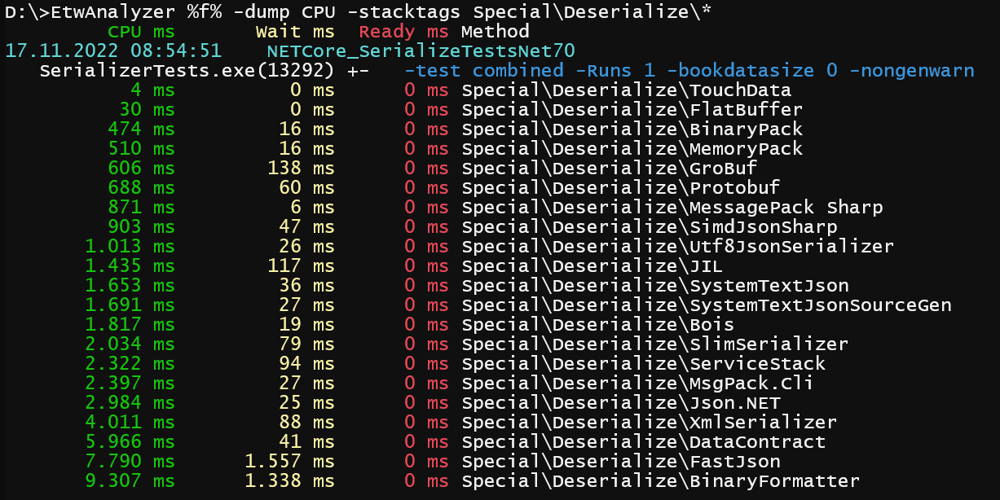

# SerializerTests
.NET Serializer testing framework

This test framework compares the most popular and fastest serializers for .NET which was the input for 
- https://aloiskraus.wordpress.com/2019/09/29/net-serialization-benchmark-2019-roundup/
- https://aloiskraus.wordpress.com/2018/05/06/serialization-performance-update-with-net-4-7-2/
- https://aloiskraus.wordpress.com/2017/04/23/the-definitive-serialization-performance-guide/


The project compiles to .NET 7, .NET 6, .NET 5, .NET Core 3.1 and .NET 4.8 where you can check out the serialization performance in your favorite .NET Framework.
To compile the solution you need Visual Studio 2022.
The currently tested Serializers are
- BinaryFormatter
- Bois (https://github.com/salarcode/Bois)
- Ceras (https://github.com/rikimaru0345/Ceras)
- DataContract
- FastJson ( https://github.com/mgholam/fastJSON/)
- FlatBuffer (https://google.github.io/flatbuffers/)
- GroBuf (https://github.com/skbkontur/GroBuf)
- JIL (https://github.com/kevin-montrose/Jil)
- Json.NET (http://www.newtonsoft.com/json)
- JsonSerializer (.NET)
- MemoryPack (https://github.com/Cysharp/MemoryPack)
- MessagePackSharp (https://github.com/neuecc/MessagePack-CSharp)
- MsgPack.Cli (https://github.com/msgpack/msgpack-cli)
- Protobuf.NET (https://github.com/mgravell/protobuf-net)
- Google Protobuf (https://github.com/protocolbuffers/protobuf)
- SerivceStack (https://github.com/ServiceStack/ServiceStack.Text)
- SimdJsonSharp ( https://github.com/EgorBo/SimdJsonSharp)
- SpanJson (https://github.com/Tornhoof/SpanJson)
- SlimSerializer (Now part of Azos) (https://github.com/azist/azos/tree/master/src/Azos/Serialization/Slim)
- Swifter.Json (https://github.com/Dogwei/Swifter.Json)
- UTF8Json (https://github.com/neuecc/Utf8Json)
- XmlSerializer


The test suite tries its best to be fair and vendor neutral. More than one serializer claims to be the fastest. 
Now you can test at your own if that is really the case. If I have forgot a great serializer (should be as fast or faster than Protobuf) 
please drop me a note and I will include it. 

#### Legacy Serializers
- Apex works only up to .NET Core 3.0. Later .NET versions break
  (https://github.com/dbolin/Apex.Serialization)
- SlimSerializer (part of NFX Project)
- Wire
- Hyperion (Wire Fork)
- ZeroFormatter

These are either no longer compatible with .NET Core 3.1 .NET 5.0 or were superseded by newer ones. Were possible
I have commented out only the serializer invocations in Program.cs so you can add them again if you are curious. 

# Running
- Clone Repo
- Build Release 
- Execute RunAll.cmd from source directory

You will get a combined CSV file for all tested serializers on your machine for .NET 7, .NET 6, .NET 5, .NET Core 3.1 and .NET 4.8.
Then you can verify the data yourself. If you want to plug in your own data types see Program.cs how to extend/modify the test suite.

# Profiling

Execute ```RunAll.cmd -profile``` from source directory after compiling. This uses WPR with MultiProfile.wprp from [FileWriter](https://github.com/Alois-xx/FileWriter).
WPR is taken from the Windows 10 SDK which needs to have installed the Windows Performance Toolkit from the [Windows SDK](https://developer.microsoft.com/en-us/windows/downloads/windows-sdk/) first.
You can use your current WPR of Windows which may work but you need to change the WPR location in RunTests.cmd and RunTests_Core.cmd.
Besides the CSV files are then the ETL files stored which you can then analyze further with WPA or [ETWAnalyzer](https://github.com/Siemens-Healthineers/ETWAnalyzer).

- SerializeTestsNet31.etl
- SerializeTestsNet48.etl
- SerializeTestsNet50.etl
- SerializeTestsNet60.etl
- SerializeTestsNet70.etl

When you overwrite the Special.stacktags of ETWAnalyzer with the one from SerializerTests like
```
copy D:\Source\git\SerializerTests\SerializerStack.stacktags D:\Utils\ETWAnalyzer\Configuration\Special.stacktags 
```
Then extract the data in the folder where the ETL files were generated

```
ETWAnalyzer -extract all -fd D:\Source\git\SerializerTests\SerializerTestResults\_8_51_33 -symserver MS
```

you get nice query capabilities which makes it easy to compare things accross .NET versions or machines. 

